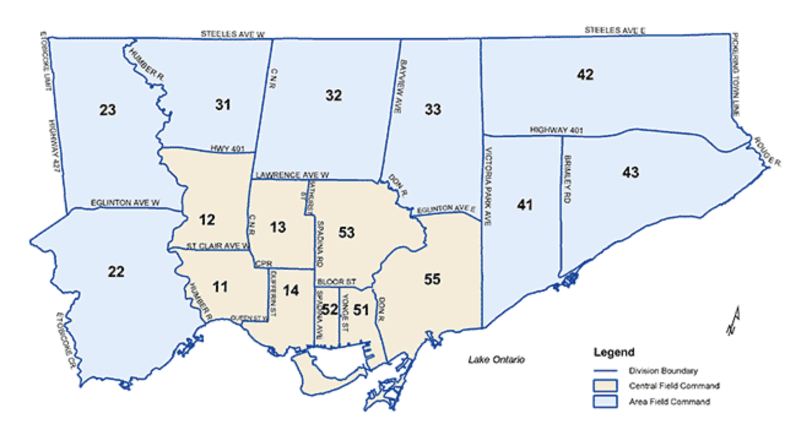

```{r setup, include=FALSE}
knitr::opts_chunk$set(echo = TRUE)
#tinytex::install_tinytex()
library(tinytex)
library(tidyverse)
library(knitr)
library(kableExtra)
library(dplyr)
library(here)
library(bookdown)
library(ggplot2)
#install.packages("wesanderson")
library(wesanderson)
#install.packages("palettetown")
library(palettetown)

crime_clean <- read_csv(here("inputs/data/clean_crime_data.csv")) 
  #grabbing cleaned dataset
factors <- c(1:4)
crime_clean[,factors] <- lapply(crime_clean[,factors], as.factor)
  #converting non numeric values to factors (including year)

crime_clean <- crime_clean %>% 
  dplyr::mutate(ClearRate = (CountCleared / Count_) * 100)
  #creating a variable to measure clearance rates 
```

# Introduction

In light of publicized cases of police brutality and evidence of racial prejudice among police forces in North America there has been a public call for governments to “defund the police”. This movement supports the reallocation of police department funds towards other services which promote public safety such as social services and community resources [@weichselbaum2020support]. While supporters range from seeking a moderate amount of reductions to a complete abolition of police services, the movement has also been criticized, with some people suggesting hastily cutting funds to the police can have consequences and might even lead to increased crime rates [@jackman2020]. However, even before the movement to defund the police grew in 2020 there have been policy concerns about police overfunding in Canada. According to a report by The Fraser Institute, the number of police officers employed per 100,000 of the population in Canada has been increasing while crime rates and officer workload^[Workload is measured as the number of criminal code incidents per officer.] have been decreasing [@di2014police]. Despite this, modern policing has evolved beyond just reactively dealing with crimes, meaning a number of other complex factors contributing to police expenditures need to be considered when discussing funding.  

Crime statistics are an important tool for budget planning and resource allocation for law enforcement funding. Data from crime reports are often used to calculate clearance rates, which measure the number of crimes successfully solved by the police [@baughman2020effective]. Clearance rates are usually used as benchmarks to compare performance among police forces and aid in decision making regarding funding allocations [@mccormick2013challenges]. However, whether clearance rates are an effective measure of police performance or not is controversial since they can be measured differently and can easily be manipulated by officers [@baughman2020effective]. Statistics on the different types of crimes committed and the areas where crimes tend to be concentrated are also useful for resource planning. For example, proactive policing practices meant to stop crimes before they occur can be implemented in certain areas with higher crime rates [@sullivan2017evidence], and can be tailored to focus on preventing certain types of crimes which may be prevalent in an area, such as drug offenses. 

Given the importance of crime statistics in characterizing crime rates and making decisions about police funding, it is important to understand how crime related data is reported and how it may be interpreted. For this report, I will use open-access data from the Toronto Police Services to analyze how crime patterns in Toronto have changed over the years and how data in criminal reports are organized and presented. More importantly, I will discuss issues of bias in how crimes are reported, the ways in which crime information from the dataset can be misleading or misinterpreted, and the real world implications these issues have. The dataset will be processed and analyzed in R [@citeR] primarily using the `tidyverse` [@tidy] and `dplyr` [@dplyr] packages. Figures and tables will be created with `ggplot2` [@ggplot]  and `kableextra` [@kableextra]. The packages `knitr` [@knitr], `bookdown` [@bookdown], and `tinytex` [@tinytex] are used to generate the R markdown report.  

# Data

## Data Source

This report utilizes data on reported crimes in Toronto obtained from the Toronto Police Service Annual Statistical Report (ASR) [@tpsasr]. The ASR is an annual overview of police related datasets covering a range of topics such as crime statistics, budget, traffic reports, and communications. Since 2019, datasets from the ASR have been openly available to the public and can be accessed through the Toronto Police Service Public Safety Data Portal or the City of Toronto Open Data Portal. The reported crimes dataset analyzed in this report was obtained in csv format from the City of Toronto Open Data Portal using the R package `opendatatoronto` [@opendatapkg]. The dataset was last updated on November 9th, 2020. 

## Methodology and Data Collection

The dataset contains information on all criminal offenses that were reported to the Toronto Police Service (TPS) from the years 2014 to 2019. Crimes can be reported to the TPS through a variety of avenues. Common criminal reporting practices include calls to emergency services (911), the Citizen Online Report Entry (CORE) system which handles reports of non-emergency incidents through telephone or online form [@CORE], and anonymous tips from Crime Stoppers [@crimestoppers]. The ASR does not specify where the reports in the dataset are collected from, and only states it includes all reported criminal offenses, including those considered unfounded after investigation. It is also unclear whether the data includes only formally filed police reports or if it also contains data from anonymous tips and reports received via Crime Stoppers. Additionally, it is unknown if the data only includes criminal offenses reported by citizens, or if it also includes crimes reported by the TPS themselves which may have been discovered on-duty through proactive policing practices. 

While this dataset contains information on all reported crimes in Toronto, it is not an accurate representation of actual crime rates in the city. There are established biases in the way crimes are selectively reported to the police, which are likely reflected in this dataset. This is sometimes referred to as the dark figure of crime, the amount of crimes which go unreported to the police. [@skogan1977dimensions]. Self-reported criminal victimization data from the 2004 GSS indicated about two-thirds of Canadians experienced a criminal incident but did not report it to the police [@statscancrime]. The majority of incidents that go unreported are crimes that are less serious in nature such as petty theft [@skogan1977dimensions], however there are still many cases in which serious offenses go unreported. Sexual assault is among one of the most under-reported criminal offenses, with 2014 GSS data reporting approximately 83% of sexual assaults were not reported to the police [@justicesexassault]. A number of factors may influence why a victim of sexual assault may choose not to report to the police such as their relationship with the perpetrator, fear of retaliation, or fear of not being believed [@kelly2008underreporting]. A large portion of hate crimes are also believed to be unreported often due to strained relationships between marginalized groups and the police resulting in a lack of confidence in law enforcement [@pezzella2019dark]. The under-reporting of various crimes leads to biased data which does not fully reflect the full breadth of crime and victimization in the city. The characteristics of people who choose to report crimes and their reasons for doing so may systematically differ from those who do not report crimes, leading to possible confounds in the data. This in turn can lead to inaccurate calculations of crime rates and clearance rates, and can result in the misallocation of police resources.

If the reported crimes in the dataset include those discovered and reported by the police themselves, issues pertaining to bias in policing must be considered when examining the data. Racial bias in policing and the use of proactive policing strategies such as stop and search has been a well-documented concern in the United States and Canada [@manski2017assessing]. Non-white individuals, particularly those who are black or Hispanic, are significantly more likely to be stopped, questioned, and arrested than white individuals [@lytle2014effects]. Black individuals in the city of Toronto receive charges for criminal and drug offences at a rate three times their baseline population data [@tstar2010]. The practice of carding in Toronto, which allowed police officers to arbitrarily stop and question individuals without any cause for criminal investigation likely contributed to racial disparities seen in policing [@evers2018economic]. In 2017, the province of Ontario implemented a policy to regulate carding after an independent review determined the practice was not effective at managing crime and disproportionately impacted racialized groups in a negative manner [@tulloch]. However the practice was not banned entirely, meaning potential effects of carding and charges laid on racialized individuals as a result of stop and search practices and racial discrimination in the police force may underlie the data analyzed in this report.


## Data Characteristics

The Reported Crimes dataset contains aggregated data of all criminal offenses reported to the TPS between the years 2014 and 2020 [@repcrimedataset]. There were 2031 observations in the dataset and 8 attributes: index, object ID, reported year, category, subtype, count (number of crimes reported), and count cleared (the number of criminal reports that were cleared). The first two attributes, index and object ID, were identical numerical identifiers which were removed prior to analysis. An additional attribute to estimate clearance rates was created during analysis by dividing the number of criminal reports counted as cleared by the total number of crimes, multiplied by 100. The crime counts were aggregated by geographical division, category, subtype and year. Finally, the criminal reports contained in the dataset include those that the TPS deemed unfounded after further investigation, crimes which may have taken place outside the city of Toronto, and crimes with no verified location. A sample view of the dataset is displayed below. 

```{r echo = FALSE}
head(crime_clean)
```
### Crime Counts and Clearance Rates

```{r, echo = FALSE, include = FALSE}
crime_filt <- crime_clean %>% 
  dplyr::select(Count_, ReportedYear, CountCleared) %>%
  group_by(ReportedYear) %>% dplyr::summarize_all(sum)
  #aggregating report counts and cleared crimes by year
  
library(reshape2)
meltcrime <- melt(crime_filt) 
  #reshaping data for graphing
```

According to information provided by the TPS in the ASR glossary, a criminal offense is considered to be cleared when a charge has been laid, recommended, or the perpetrator(s) have been identified but no charges have been laid. However, it is unclear whether cleared cases in this dataset also include cases deemed unfounded by the police. Figure \@ref(fig:countsfig)^[Data were formatted for graphing using the `melt` package; Colour palette in Figure 1 is from the `wesanderson` package [@wes]] displays the total number of crimes reported and total number of crimes that were cleared by year. 

```{r countsfig, fig.cap="Total Number of Reported Crimes by Year", echo = FALSE, fig.width=8, fig.height=3.6}
#plotting the total number of crimes reported and total number of crimes cleared
ggplot(meltcrime, aes(x = ReportedYear, y = value, fill = variable)) +
  geom_bar(stat = "identity") +
  scale_fill_manual(values = wes_palette("Royal2", 2), labels = c("Total Reported", "Cleared")) + 
  geom_text(aes(label=value), size = 4, position = position_stack(vjust = 0.5)) +
  theme_light() + 
  labs(x = "Year", y = "Number of Reports", fill = "Reported Crimes", title = "Reported Crimes are Gradually Increasing") +
  theme(plot.title = element_text(face = "bold"))
```


Note that the year refers to the year the crime was reported to the police, and does not necessarily indicate the year the crime took place. Based on the figure, we can see a slight gradual increase in the number of crimes reported to the TPS between the years 2014 and 2018, with the number of reports in 2019 being similar to those from 2018. This does not necessarily mean that crime has been increasing in Toronto, since a number of factors can contribute to observed increases in crime reports, such as population growth. Similarly, the "true" number of crimes is unknown due to under-reporting. 

Meanwhile, the number of crimes cleared by the police appears to have remained steady over the years despite increases in reported crimes. Clearance rates have gradually decreased between 2014 and 2017 before sharply decreasing between 2017 and 2018. The annual rates are listed as follows: 2014 (52.8%), 2015 (50.7%), 2016 (48.9%), 2017 (46.8%), 2018 (41.9%), and 2019 (41.5%). However this is just a rough estimate of the clearance rate calculated based on the data provided in the dataset and should be interpreted with caution. Many police forces use weighted clearance rates based on the severity of the crime to estimate performance whereas clearance of more serious crimes such as homicide or assault are given greater weighting than less serious crimes [@mccormick2013challenges]. Further examination into clearance rates for different types of crimes may provide better insights into why clearance rates appear to be decreasing. Notably, this dataset does not include reported homicides, as there is a separate dataset in the ASR for homicide reports. 


### Category

```{r, include = FALSE}
crime_filt %>% 
  mutate(ClearRate = (CountCleared / Count_) * 100) 
  #calculating aggregate clearance rates per year
```

The category variable contains information on the type of criminal offense reported to the police. The dataset lists six main offense categories: crimes against property, crimes against the person, controlled drugs and substances, criminal code traffic, other criminal code violations, and other federal violations. Incidents categorized as multiple offense types were included multiple times in the dataset in each relevant category. Figure \@ref(fig:yearcat)^[Colour palettes in Figures 2 and 3 are from the `palettetown` package [@palette]] displays the distributions of reported crimes between 2014-2019 by category. 

Across all six years, property crimes are consistently the most frequently reported crimes out of all the offense types. Property crimes have also shown the largest increase in reports, particularly between the years 2015 and 2018. This could suggest that the increase in total crimes reported across the years observed might be partially explained by the growing number of property crimes that have been reporting. After crimes against property, crimes against the person and other criminal code violations were the most frequently reported crimes, both showing a small but gradual increase over the years. The remaining three categories, controlled drugs and substances, criminal code traffic, and other federal statute violations were the least frequently reported crimes. 

```{r yearcat, fig.cap="Number of Crimes Reported in Toronto by Category and Year", fig.pos = "H", echo = FALSE, fig.width=8, fig.height=3.2}
#plotting the number of crimes reported by category and year
crime_clean %>% 
  dplyr::select(Category, Count_, ReportedYear, CountCleared) %>%
  group_by(ReportedYear, Category) %>% dplyr::summarize_all(sum) %>%
  mutate(ClearRate = CountCleared / Count_) %>%
  ggplot() + 
  geom_point(aes(x = ReportedYear, y = Count_, color = Category), size = 2) +  
  scale_color_poke(pokemon = 'Charizard', spread = NULL)+ 
  theme_light() + 
  labs(x = "Year", y = "Number of Crimes Reported", 
       title = "Property Crimes Are the Most Frequently Reported Category Offense") + 
  guides(color = guide_legend(override.aes = list(size=3))) +
    theme(plot.title = element_text(face = "bold"))
```

Clearance rates by criminal offense category are displayed in Figure \@ref(fig:clearcat). Offense categories that were reported less frequently such as controlled drugs and substances, criminal code traffic, other criminal code violations, and other federal statute violations had the highest clearance rates (all above 80%). Clearance rates for Crimes against the Person are in the moderate range (around 60%). Depending on the severity, many of the cleared crimes in this category such as assault and attempted murder would be given higher weighting if a weighted method was used to calculate clearance rates. Property crimes had the lowest clearance rates which declined from 36.4% in 2014 to 25.4% in 2019. Given the disproportionately high number of property crimes reported in this dataset compared to other categories, the decreasing clearance rates in this category likely contribute to the overall trend of low and decreasing clearance rates among all the crimes discussed earlier. 

```{r clearcat, fig.cap="Clearance Rates by Category and Year", echo = FALSE, fig.pos = "H", fig.width=8, fig.height=3.2}
#plotting clearance rates by category and year
crime_clean %>% 
  dplyr::select(Category, Count_, CountCleared, ReportedYear) %>%
  group_by(ReportedYear, Category) %>% dplyr::summarize_all(sum) %>%
  mutate(ClearRate = (CountCleared / Count_) * 100) %>%
  ggplot(aes(x = ReportedYear, y = ClearRate, color = Category)) + geom_point(size = 2) + theme_light() + 
  scale_color_poke(pokemon = 'Charizard', spread = NULL) + labs(x = "Year", y = "Clearance Rates (%)", title = "Clearance Rates Vary Among Offense Categories") +   theme(plot.title = element_text(face = "bold"))
```


### Subtype

Reported crimes are further broken up into subtypes based on the six main category offenses. Table \@ref(tab:subtype)^[Table made with `kableextra` package [@kableextra]] lists the number of crimes reported by year for each subtype. Again, crimes which involve multiple subtypes are included multiple times in the dataset under each relevant subtype. This can lead to an inflated estimation of the number of actual incidents which occur based on this data and impacts the reliability of the clearance rates that were calculated. An estimated one half of sentenced offenders are sentenced for multiple crimes, although it is unclear if this applies to the categorization of multiple offenses when crimes are reported prior to sentencing [@Roberts2016]. Statistics Canada recommends only reporting or counting the most serious offense in incidents involving multiple offenses when calculating crime rates to avoid issues of over-counting [@statcancount]. 


```{r subtype, echo = FALSE, fig.width=8, fig.height=4}
#filter and aggregate data based on subtype and year
crime_wide <- crime_clean %>% 
  dplyr::select(Subtype, Count_, ReportedYear, Category) %>%
  group_by(Category, Subtype, ReportedYear) %>% dplyr::summarize_all(sum) %>%
  pivot_wider(names_from = ReportedYear, values_from = Count_) 
#create table with crime counts by subtype
kbl(crime_wide[-1], caption = "Offense Subtypes of Crimes Reported to TPS", booktabs = T, longtable = TRUE) %>%
    kable_styling(bootstrap_options = c("hover", "condensed")) %>%
    kable_paper("striped", full_width = F) %>%
    group_rows("Crimes Against Property",2, 10) %>%
    group_rows("Crimes Against the Person", 11, 16)  %>%
    group_rows("Other Criminal Code Violations", 18,19)  %>%
    group_rows("Controlled Drugs and Substances Act", 1, 1)  %>%
    group_rows("Criminal Code Traffic", 17, 17)  %>%
    group_rows("Other Federal Statute Violations", 20, 20) 

```


Crimes against property is the category with the most offense subtypes, with theft under $5000 being the most frequently reported criminal subtype across all the categories followed by assault. While the number of sexual violation reports are on the lower end, the numbers in the dataset likely only represent a small fraction of this type of crime due to historic under-reporting of sexual assault [@kelly2008underreporting]. It is also unclear if sexual violation includes all sex related crimes, since sexual assault is often categorized under assault charges, or if cases of sexual assault are counted twice under assault and sexual violations. Frequencies for other criminal subtypes are likely lower estimates of the actual number of cases due to under-reporting, especially for smaller crimes. [@skogan1977dimensions]. Comparing reports from this dataset to anonymized victimization data might give a better indication of the frequency of various types of criminal offenses which occur in the city. 

### Geographical Division

The ‘GeoDivision’ variable in the dataset refers to the geographical division in which the reported crime took place. The divisions correspond to the TPS divisions, pictured geographically in Figure \@ref(fig:divmap)^[Source: Toronto Police Service [@TPSdiv]]. Figure \@ref(fig:geodiv) displays the total number of crimes reported to the TPS by division^[Division 54 and 55 were officially consolidated into one division in 2018] and year. 


```{r divmap, out.width="80%", fig.cap="Toronto Police Command and Divisional Boundaries", fig.height=3.5, echo = FALSE}

```

```{r geodiv, fig.cap="Total Number of Crimes Reported in Toronto by Division and Year",echo = FALSE, fig.width=8, fig.height=3.5}
#plot crime counts by year and geographical division
crime_clean %>% 
  dplyr::select(GeoDivision, Count_, ReportedYear) %>%
  group_by(ReportedYear, GeoDivision) %>% dplyr::summarize_all(sum) %>%
  ggplot() + geom_bar(aes(x = GeoDivision, y = Count_, fill = ReportedYear), stat="identity") +
  coord_flip() +
  scale_fill_poke(pokemon = 'squirtle', spread = NULL) +
  theme_light() +
  labs(x = "Geographical Division", y = "Number of Crimes Reported", 
       title = "Reported Crimes are Higher in the Downtown Core") +
    theme(plot.title = element_text(face = "bold"))
```


Reported crime rates appear to vary by area, with divisions 52, 51, and 55 displaying the most crimes reported in the dataset. Noticeably, these divisions are adjacent to one another and roughly represent the downtown core of the city of Toronto, also called the Central Field of Command. This is consistent with past research which suggests crime is usually concentrated in certain geographical hotspots [@farrell2015crime]. The top two divisions with the highest number of criminal reports (divisions 51 and 52) are significantly smaller in terms of geographical space compared to the other divisions, however these areas are likely the most densely populated since they are situated in the downtown core. Higher crime rates in downtown Toronto are generally associated with the number of bars and nightclubs in the area, and the increased homeless population [@OSAC]. However, we should be careful when simply attributing neighbourhood crime rates to particular locations and populations when there are a variety of complex underlying factors which may impact why certain areas have higher crime rates than others. For example, a report on spatial analysis of crime in Toronto identified a strong relationship between violent crime rates and access to socioeconomic resources [@charron2009]. Crime statistics such as neighbourhood crime rates can be useful indicators of crime patterns in the city, but they don’t adequately capture the complexities of why these crimes occur. Carelessly labeling neighbourhoods as more dangerous without addressing the underlying factors which may be contributing to the crime rates can have harmful implications for these communities, including stigmatization by the public and increased police presence and profiling. 

\newpage

# References


